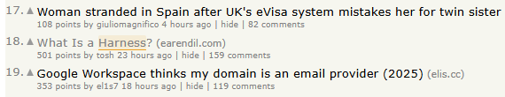
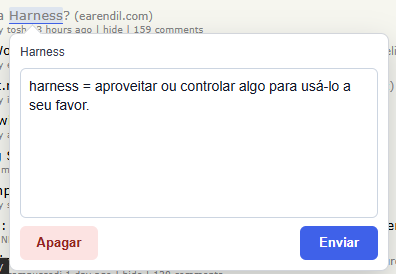

# English Notes

Extensão para Chrome que ajuda nos estudos de inglês: selecione uma palavra ou frase em qualquer página, crie uma marcação e registre uma anotação. As anotações são salvas localmente no navegador e os textos marcados são destacados novamente quando aparecem na página.

Ao passar o mouse sobre uma marcação, é possível visualizar, editar ou apagar a anotação.

